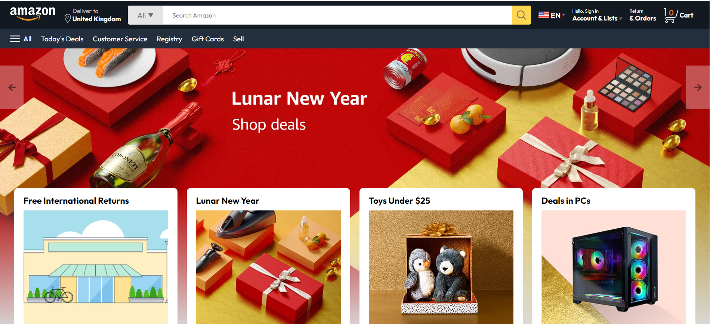

**Amazon Website Clone README**

## Overview:
This Amazon Website Clone is a project aimed at replicating the basic functionalities and layout of the Amazon e-commerce platform using HTML, CSS, and JavaScript. It provides users with an interface similar to Amazon's, allowing them to browse products, view product details, add items to the cart, and proceed with checkout.

## Features:
1. **Product Listing:** Displays a range of products with details such as name, price, and image.
2. **Product Search:** Allows users to search for products by name or category.
3. **Product Details:** Provides detailed information about each product, including description, specifications, and customer reviews.
4. **Shopping Cart:** Enables users to add products to their cart and manage the items before proceeding to checkout.
5. **User Authentication:** Simulates user authentication functionalities such as login, registration, and account management.
6. **Responsive Design:** Ensures the website is accessible and functional across various devices and screen sizes.

## Technologies Used:
- **HTML:** Provides the structure and content of the web pages.
- **CSS:** Styles the elements and enhances the visual appeal of the website.
- **JavaScript:** Implements interactive features, dynamic content, and client-side validation.
- **Local Storage:** Utilizes browser's local storage for maintaining cart items and user session data.

## Getting Started:
To run the Amazon Website Clone locally, follow these steps:

1. **Clone the Repository:** Clone this repository to your local machine using the following command:
   ```
   git clone https://github.com/MariaBeatriceNamatovu/Amazon-clone.git
   ```

2. **Navigate to the Directory:** Move into the directory containing the Amazon Website Clone files:
   ```
   cd Amazon-clone
   ```

3. **Open Index.html:** Open the `index.html` file in your preferred web browser to view the website locally.

## Usage:
1. **Browse Products:** Explore the range of products available on the website by navigating through categories or using the search functionality.
2. **View Product Details:** Click on a product to view its detailed information, including description, specifications, and reviews.
3. **Add to Cart:** Add desired items to the cart by selecting the quantity and clicking the "Add to Cart" button.
4. **Manage Cart:** Review items in the cart, update quantities, or remove items before proceeding to checkout.
5. **Checkout:** Proceed to checkout by providing shipping and payment details, and complete the purchase.

## Preview:
Include a screenshot or link to a hosted version of the Amazon Website Clone.

## Credits:
- **Amazon:** This project is inspired by the layout and functionalities of the Amazon e-commerce platform.

## Support:
For any questions, issues, or feedback, please contact namatovutrismari@gmail.com.

## License:
This project is licensed under the [MIT License](LICENSE). Feel free to modify and distribute the code for personal or commercial use.

